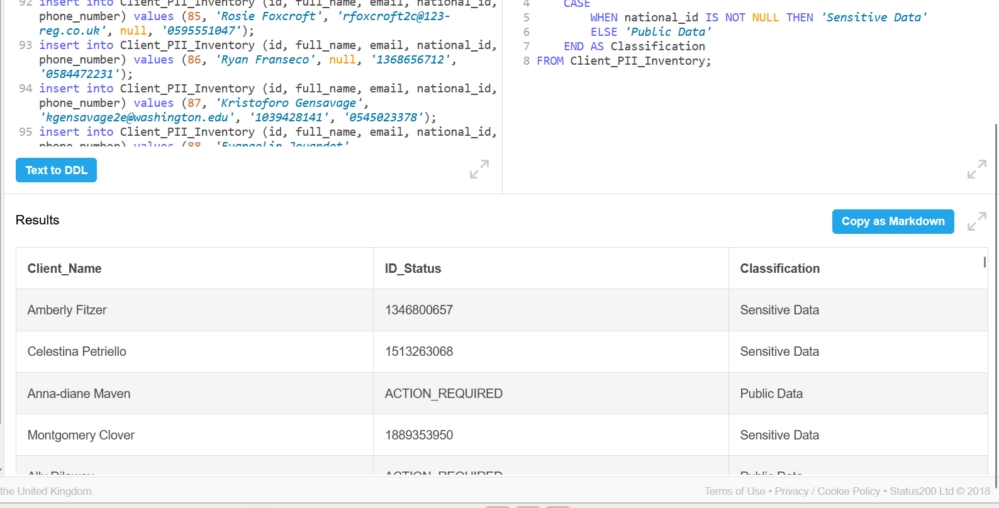

# Saudi PDPL & NDMO Data Governance Framework (SQL)

## 📌 Project Overview
This project demonstrates a technical implementation of **Data Governance** and **Privacy Compliance** using SQL. It focuses on auditing Personal Identifiable Information (PII) to align with the **Saudi Personal Data Protection Law (PDPL)** and **NDMO** standards.

## 🚀 Key Features
* **Data Discovery:** Automated identification of sensitive vs. non-sensitive data.
* **Data Cleansing:** Handling missing National IDs and emails using `COALESCE` logic to ensure data completeness.
* **PII Classification:** Categorizing data into (Sensitive, Personal, or Public) based on legal requirements.
* **Compliance Auditing:** A built-in "Compliance Status" engine that flags non-compliant records (e.g., missing identifiers).

## 🛠️ Technical Implementation
The project uses advanced SQL queries to:
1. **Identify Gaps:** Find records with missing mandatory PII.
2. **Standardize Records:** Apply cleansing scripts to prepare data for auditing.
3. **Automate Labeling:** Use `CASE` statements to label data sensitivity levels.

## 📊 Project Results
Here is a sample of the generated compliance report showing the logic in action:

## 📂 Repository Structure
* `Database_Setup.sql`: The script to build the PII inventory table and 100 sample records.
* `Compliance_Analysis.sql`: The main engine for classification and cleansing.
